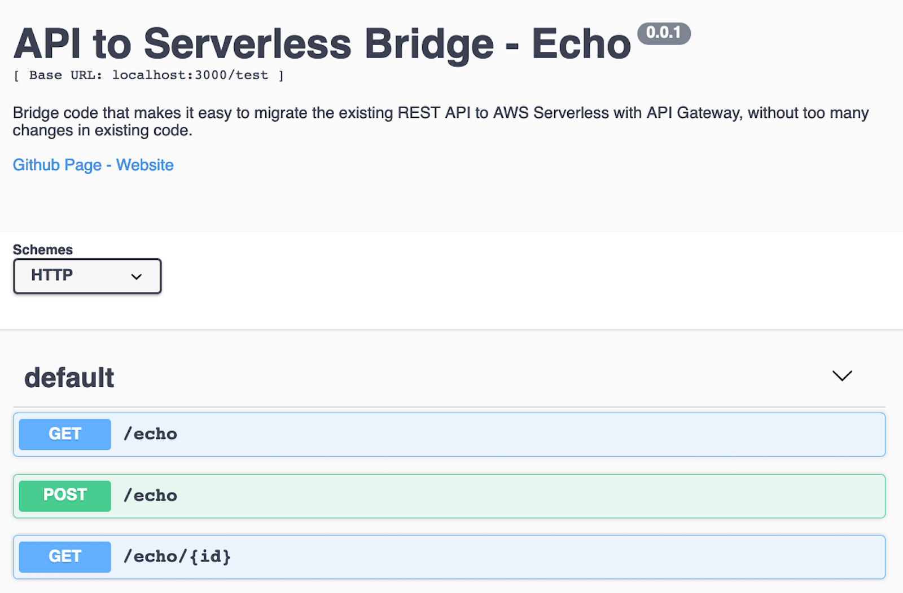
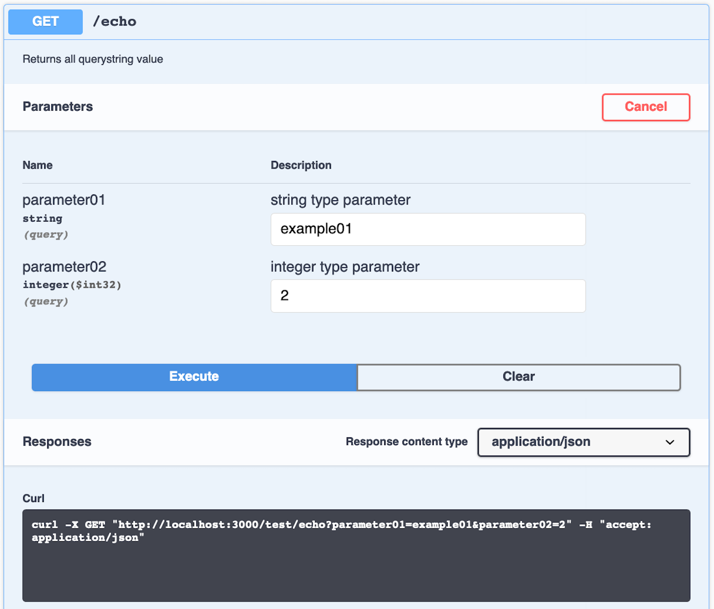

# API to Serverless Bridge

Bridge code that makes it easy to migrate the existing REST API to [AWS](https://aws.amazon.com/) Serverless with API Gateway, **without too many changes in existing code**.


## Table of Contents

<details>
<summary>Click to expand</summary>

- [Objective](#objective)
- [Brief](#brief)
- [Solution](#solution)
- [How to Build](#how-to-build)
- [Conclusion](#conclusion)
- [Swagger API Test](#swagger-api-test)
- [Contributing](#contributing)
- [References](#references)

</details>


## Objective

The purpose of this repository is to give developers a way to move the Existing HTTP Node.js application and the REST API (including but not limited to using frameworks such as Express) to AWS Lambda Serverless, **without too many changes in existing code**.

Understanding Serverless and the use of Gateway API is quite a headache for some developers. Especially about how to **get** the data request and how to **send** the response.

This repository should contain:

- The code bridge library,
- Echo API controllers example,
- PM2 configuration file,
- Swagger API Test Tools,
- Socket example.

This repository does not contain:

- Code that comprises a complete application.

## Brief

Imagine, in the current API, we have  API url that gives echo from all value that receipt (GET):

[http://localhost:3000/test/echo?var1=value1&var2=value2](http://localhost:3000/test/echo?var1=value1&var2=value2)

which will display the following results:

```bash
# curl http://localhost:3000/test/echo?var1=value1
{
  "status": 200,
  "msg": "echo",
  "name": "Your System Name",
  "id": "",
  "query": {
    "var1": "value1"
  }
}

```

the router code is:

```js
router.get('/echo',(req, res) => {
  controller.echoController.echoGet(req,res);
});
```

and the controller code:

```js
function echoGet(req,res,next){
    console.log("ECHO: Get");
    let echoID = (typeof req.params.id === 'undefined') ? '' : req.params.id;
    res.header("x-header", "header content #1");
    return res.json({
        status: 200, 
        msg: 'echo', 
        name: Config.system.name, 
        id: echoID, 
        query: req.query
    });
}
```

It is not unusual for nodejs developers to use the 'req' parameter in retrieving data / parameters.

But on [Amazon Lambda](https://aws.amazon.com/lambda/), there are things that are slightly different in taking data / parameters. 
Amazon Lambda Function provides all content through an 'event', and the handling will be slightly different compared to the API in general.


AWS Lambda function code:

```js
module.exports.yourFunction = async (event, context, callback) => {
    //
    //
    //
};
```

that 'event' variable has everything that we need, like header, method, params, querystring, raw body, etc.

*So, how do I use AWS Lambda, but I don't want to make many changes to my code? And the PATH URL must be the same as before.*

## Solution

I have created a **wrapper** / **bridge** that will make it easier to combine AWS Lambda into the existing API Controller and embed it with the API Gateway, but still has the same URL path.

[See file "lambda_handler.js"](lambda_handler.js)

## How to Build

### Prerequisite

- NodeJs
- Amazon Web Service (AWS) Account

### Build as Common API

You can build this repo both as a conventional API and as serverless.

similar to other APIs developed with nodes, you can use npm or yarn.

```bash
$ yarn
$ node index.js
Listening on port 300
```

if you use nodemon:

```bash
$ yarn
$ nodemon index.js
[nodemon] 1.18.11
[nodemon] to restart at any time, enter `rs`
[nodemon] watching: *.*
[nodemon] starting `node index.js`
Listening on port 3000
```

we can access the API with this url:

- http://localhost:3000/test/echo?var1=value1
- http://localhost:3000/test/echo/123?var1=value1

Manual test from terminal, method GET

```bash
$ curl "http://localhost:3000/test/echo/123?var1=value1"
{
  "status": 200,
  "msg": "echo",
  "name": "Your System Name",
  "id": "123",
  "query": {
    "var1": "value1"
  }
}
```

Manual test from terminal, method POST

```bash
$ curl -X POST \
  "http://localhost:3000/test/echo?var1=value1&var2=value2" \
  -H 'Content-Type: application/json' \
  -H 'client-id: yourClientID' \
  -H 'client-id: yourClientSecret' \
  -H 'cache-control: no-cache' \
  -d '{
    "post01": "data 01",
    "post02": "data 02"
}'

{
  "status": 200,
  "msg": "echo",
  "query": {
    "var1": "value1",
    "var2": "value2"
  },
  "data": {
    "post01": "data 01",
    "post02": "data 02"
  }
}
```

### Build as AWS Lambda / API Gateway

Make sure read the documentation of [Nodejs Serverless Framework](https://serverless.com/framework/docs/).

One thing we need to make sure before deploying this service is that we create and store the required AWS credentials. Details can be found [here](https://serverless.com/framework/docs/providers/aws/guide/credentials/). You can even use below command to set AWS credentials for serverless:

```
$ serverless config credentials --provider aws --key AWS_ACCESS_KEY --secret AWS_SECRET
```

[see serverless configuration file](serverless.yml)

```bash
$ serverless deploy
Serverless: Packaging service...
Serverless: Excluding development dependencies...
Serverless: Uploading CloudFormation file to S3...
Serverless: Uploading artifacts...
Serverless: Uploading service bridge.zip file to S3 (2.88 MB)...
Serverless: Validating template...
Serverless: Updating Stack...
Serverless: Checking Stack update progress...
................................
Serverless: Stack update finished...
Service Information
api keys:
  None
endpoints:
  GET - https://****.execute-api.ap-southeast-1.amazonaws.com/dev/{parameters+}
  GET - https://****.execute-api.ap-southeast-1.amazonaws.com/dev/test/echo/{id+}
  GET - https://****.execute-api.ap-southeast-1.amazonaws.com/dev/test/echo/{id}
  POST - https://****.execute-api.ap-southeast-1.amazonaws.com/dev/test/echo
functions:
  app: bridge-dev-app
  getDetail1: bridge-dev-getDetail1
  getDetail: bridge-dev-getDetail
  postExample: bridge-dev-postExample

```

This command will automatically create the **Serverless Lambda Function** and **API Gateway** in the AWS account.

We can invoke our lambda function using “invoke” command from the local system and get logs in response from lambda.

```bash
$ serverless invoke -f yourFunction -l
```

Manual test from terminal, method GET

```bash
$ curl "https://****.execute-api.ap-southeast-1.amazonaws.com/dev/test/echo/123?var1=value1"
{
  "status": 200,
  "msg": "echo",
  "name": "Your System Name",
  "id": "123",
  "query": {
    "var1": "value1"
  }
}
```

Manual test from terminal, method POST

```bash
$ curl -X POST \
  "https://****.execute-api.ap-southeast-1.amazonaws.com/dev/test/echo?var1=value1&var2=value2" \
  -H 'Content-Type: application/json' \
  -H 'client-id: yourClientID' \
  -H 'client-id: yourClientSecret' \
  -H 'cache-control: no-cache' \
  -d '{
    "post01": "data 01",
    "post02": "data 02"
}'

{
  "status": 200,
  "msg": "echo",
  "query": {
    "var1": "value1",
    "var2": "value2"
  },
  "data": {
    "post01": "data 01",
    "post02": "data 02"
  }
}
```

## Swagger API Test


This API demo is built in with Swagger API Test. You can access it from url [http://localhost:3000/api-docs/](http://localhost:3000/api-docs/)






## Conclusion

As long as your API code is still quite simple, it is possible to start implementing serverless easily, without any changes from the previous code.

If you are going to start building applications with serverless infrastructure, but still want to keep the code running as a common API, this method can be an alternative.

## Contributing

We are happy to accept more line code from the community. 🎉

## References

- [Amazon AWS Lambda Documentation](https://docs.aws.amazon.com/lambda/index.html)
- [Amazon AWS API Gateway Documentation](https://docs.aws.amazon.com/apigateway/index.html)
- [Nodejs Serverless Framework](https://serverless.com/)
- [Swagger API Testtools](https://swagger.io/)
